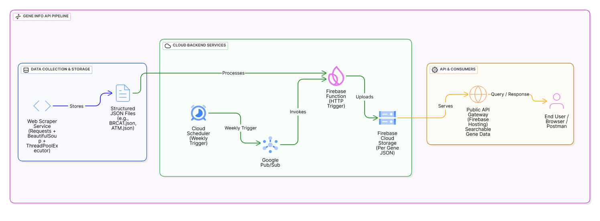

# 🚀A complete Gene Information API using Web Crawling+ Cloud Automation.

Over the past few weeks, I built an end-to-end system to make gene information easily accessible online. 

### Here’s what I implemented:

## 👉 Data Collection/Web Crawling Pipeline

Crawled ~1500+ gene pages from MedlinePlus using Requests + BeautifulSoup.
Optimized the crawler with multithreading (ThreadPoolExecutor).
Stored each gene’s information (e.g., BRCA1.json, ATM.json) separately in structured JSON format.

## 👉 Cloud Integration

Created an HTTP-triggered Firebase Function to automatically upload data into Firebase Cloud Storage(separate JSON file per gene)

## 👉 Automation

Integrated Google Cloud Pub/Sub + Cloud Scheduler to refresh the data weekly.
Ensures the system stays up-to-date with new or updated genes.

## 👉 Public API Deployment

Built and deployed a searchable API on Firebase.
Anyone can query a gene name and instantly get its information along with related conditions in the browser.

## 💡 Key Learnings:

-> Data Engineering (ETL, scraping, structured storage)
-> Cloud Computing (Firebase, Google Cloud Pub/Sub, Scheduler)
-> API Development & Deployment
-> Automation + Scalable system design

## 📂 Project Structure

``` bash
FIREBASE AUTOMATION FUNCTION FOR FETCHING GENES AND ITS CONDITION/
│
├── assets/                     # GENE INFO API PIPELINE 
│   └── architecture.png
│
├── functions/                  # Firebase functions code
│   ├── __pycache__/
│   ├── api_gene/
│   │   ├── __init__.py
│   │   └── get_gene_data.py
│   ├── scraping/
│   │   ├── __init__.py
│   │   └── medlineplus.py
│   ├── utils/
│   │   ├── __init__.py
│   │   └── storage_utils.py
│   └── main.py
│
├── venv/                       # Virtual environment
│
├── .gitignore
├── requirements.txt
├── firebase.json
├── .firebaserc
└── README.md                   
```

## Gene Info API System Architecture




