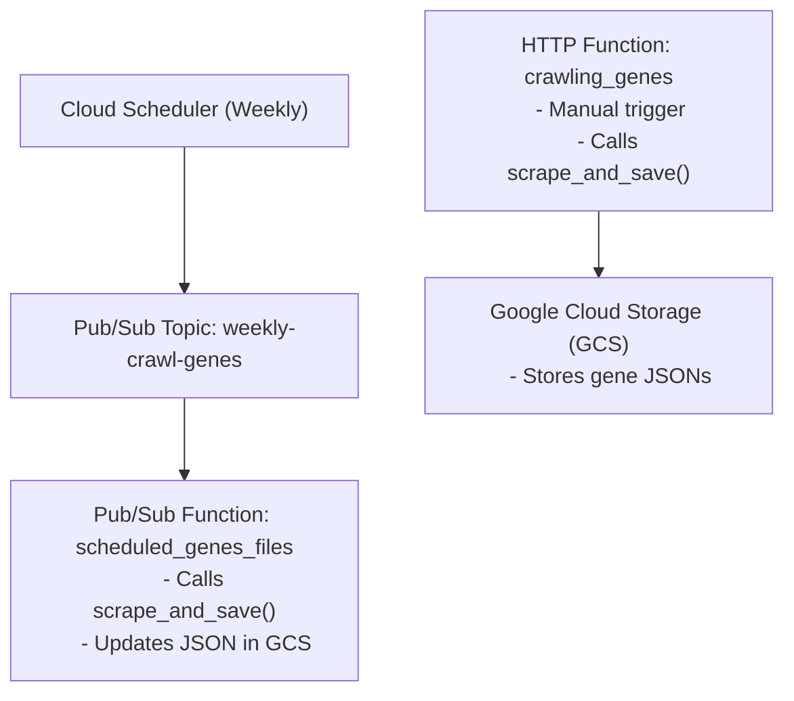

# 🧬 Firebase Automation Function for Fetching Genes & Conditions

This project automates the process of fetching **gene information and related conditions** from [MedlinePlus Genetics](https://medlineplus.gov/genetics/gene).  
The data is scraped **A → Z** and stored as **JSON files in Google Cloud Storage (Firebase Storage)**.

---

## 🚀 Features
It uses Firebase Cloud Functions (Python) and Google Cloud Storage (GCS) to provide:

### 🧬 Automated Gene Scraping

Scrapes all gene pages A → Z from MedlinePlus.

Extracts gene names and their associated conditions.

Stores each gene as an individual JSON file in a GCS bucket (genes/all_genes_separate_files/GENE.json).

### ⚡ Cloud Function Triggers

HTTP Function (crawling_genes) → Manually trigger scraping via browser or curl.

##### Pub/Sub Scheduled Function (scheduled_genes_files) → Runs weekly via Cloud Scheduler → Pub/Sub, updating gene data automatically
---

## 🏗 Project Structure
``` bash 
functions/
│── main.py # Main scraping + Firebase Functions logic
│── requirements.txt # Python dependencies
firebase.json # Firebase configuration
.firebaserc # Project alias for deployment
```

---

## 🔧 Setup & Installation

### 1️⃣ Clone the repository
```bash
git clone (https://github.com/Datawith-MdAtaullah/FETCHING-LIVE-DATA-FROM-A-WEBSITE-.git)
cd <repo-name>/functions
```

### 2️⃣ Create a virtual environment
``` bash
python -m venv venv
source venv/bin/activate   # Linux / Mac
venv\Scripts\activate      # Windows
```

### 3️⃣ Install dependencies

``` bash
pip install -r requirements.txt
```
### 4️⃣ Login to Firebase
``` bash 
firebase login
```
### 5️⃣ Initialize Firebase Functions (Python)
``` bash
firebase init functions
# Choose Python and existing files
```
### 6️⃣ Deploy Functions
``` bash
firebase deploy --only functions
```
---

## ⚡ Usage

### 1. Manual scrape (HTTP trigger)
``` bash
curl https://<region>-<project-id>.cloudfunctions.net/crawling_genes
```

### 2. Weekly scheduled scrape

Runs automatically via Cloud Scheduler → Pub/Sub → scheduled_genes_files

---

## 📊 Execution Flow

## 📊 Execution Flow



## 📝 Example Output (per gene JSON)
``` bash
{
  "gene": "BRCA1",
  "conditions": [
    "Breast cancer",
    "Ovarian cancer"
  ]
}
```
## 📌 Requirements

Python 3.9+

Firebase CLI installed (npm install -g firebase-tools)

Google Cloud credentials with Storage access

## 👨‍💻 Author

MD ATAULLAH  – https://github.com/Datawith-MdAtaullah


